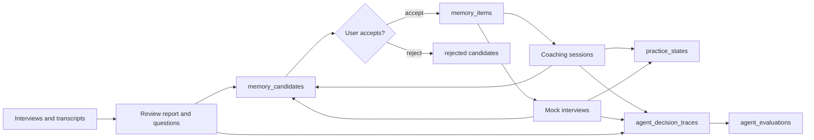

# Task Agent Workbench Implementation Plan

> **For agentic workers:** REQUIRED SUB-SKILL: Use superpowers:subagent-driven-development (recommended) or superpowers:executing-plans to implement this plan task-by-task. Steps use checkbox (`- [ ]`) syntax for tracking.

**Goal:** Convert the current Vue demo console into a multi-page task-oriented Agent interview training workbench with minimal read-only backend aggregation APIs and a global memory candidate query.

**Architecture:** Keep existing business Agents and state machines unchanged. Add small Go aggregation services/controllers for dashboard and interview detail, add a filtered global memory candidate query, then split the frontend into a Vue Router shell with focused pages for dashboard, interviews, memory, coaching, mock interview, and engineering trace. Preserve the `memory_candidates -> accept/reject -> memory_items` boundary by keeping all formal memory writes behind the existing accept endpoint.

**Tech Stack:** Go, Gin, GORM, SQLite, Vue 3, Vite, vue-router 4, existing `/api` JSON wrapper.

---

## File Structure

Backend additions:

- Create `server/workbench_summary_service.go`: read-only dashboard summary aggregation and small summary DTO conversion helpers.
- Create `server/workbench_summary_controller.go`: `GET /api/dashboard-summary`.
- Create `server/workbench_summary_service_test.go`: dashboard aggregation tests.
- Create `server/interview_detail_service.go`: read-only interview detail aggregation.
- Create `server/interview_detail_controller.go`: `GET /api/interviews/:interview_id/detail`.
- Create `server/interview_detail_service_test.go`: interview detail aggregation tests.
- Modify `server/memory_candidate_service.go`: add `MemoryCandidateQuery` and `ListMemoryCandidatesByQuery`.
- Modify `server/memory_candidate_controller.go`: add global `GET /api/memory-candidates`.
- Create `server/memory_candidate_query_test.go`: global memory candidate filtering tests.
- Modify `server/controller.go`: register new routes.
- Modify `vo/vo.go`: add response VOs for dashboard summary and interview detail.

Frontend additions:

- Modify `frontend/package.json`: add `vue-router`.
- Modify `frontend/package-lock.json`: generated by `npm install`.
- Modify `frontend/src/main.js`: install router.
- Replace `frontend/src/App.vue`: app shell only, with navigation, user selector, status bar, and `<RouterView>`.
- Create `frontend/src/router.js`: route table and navigation metadata.
- Create `frontend/src/workbenchState.js`: shared user id, selected ids, global notices.
- Modify `frontend/src/api.js`: typed API helper functions for new and existing endpoints.
- Create `frontend/src/pages/DashboardPage.vue`: system overview.
- Create `frontend/src/pages/InterviewsPage.vue`: interview list, create, transcript/media entry points.
- Create `frontend/src/pages/InterviewDetailPage.vue`: aggregated interview inspection.
- Create `frontend/src/pages/MemoryInboxPage.vue`: global candidate filters, accept/reject, accepted memory items.
- Create `frontend/src/pages/CoachingPage.vue`: plan/session state machine UI.
- Create `frontend/src/pages/MockInterviewPage.vue`: mock session state machine UI.
- Create `frontend/src/pages/EngineeringTracePage.vue`: traces and evaluation evidence.
- Create `frontend/src/components/StatusBadge.vue`: compact status display.
- Create `frontend/src/components/EmptyState.vue`: reusable empty state.
- Create `frontend/src/components/ErrorNotice.vue`: explicit API/model failure display.
- Create `frontend/src/components/TracePanel.vue`: selected context, raw output, parsed decision, service actions.
- Modify `frontend/src/styles.css`: workbench layout, dense page grids, tables, forms, status colors, responsive behavior.

Documentation:

- Modify `README.md`: reposition as task-oriented Agent engineering project.
- Modify `docs/DEMO_GUIDE.md`: multi-page demo flow.
- Create `docs/WORKBENCH_ARCHITECTURE.md`: architecture/data-flow diagram and memory boundary explanation.
- Create `docs/RESUME_TALKING_POINTS.md`: resume bullets and interview talk tracks.

## Non-Negotiable Constraints

- Do not create new business Agents.
- Do not add ReAct, MCP, or OpenAI function calling to the core flow.
- Do not change coaching/mock state machine semantics.
- Do not let any Agent or aggregation endpoint write `memory_items`.
- Keep dashboard and interview detail APIs read-only.
- Memory Inbox must show that `memory_candidates` become `memory_items` only through accept/reject actions.

## Task 1: Dashboard Summary Read Model

**Files:**
- Modify: `vo/vo.go`
- Create: `server/workbench_summary_service.go`
- Create: `server/workbench_summary_service_test.go`

- [ ] **Step 1: Add failing dashboard summary service test**

Add this test file:

```go
package server

import (
	"testing"
	"time"
)

func TestGetDashboardSummaryAggregatesUserWorkbenchState(t *testing.T) {
	s := newTestServer(t)
	now := time.Now().Unix()

	interview := InterviewSession{
		InterviewID:    "interview_dash_1",
		UserID:         "user_dash",
		CompanyName:    "ByteDance",
		JobTitle:       "Agent Engineer",
		InterviewRound: "second_round",
		InterviewType:  "technical",
		Status:         InterviewStatusReadyForReview,
		CreatedAt:      now - 100,
		UpdatedAt:      now - 90,
	}
	if err := s.db.Create(&interview).Error; err != nil {
		t.Fatalf("seed interview: %v", err)
	}
	if err := s.db.Create(&MemoryCandidate{
		CandidateID:   "candidate_dash_pending",
		UserID:        "user_dash",
		InterviewID:   interview.InterviewID,
		MemoryType:    MemoryTypeUserWeakness,
		SubjectKey:    "user:weakness",
		Content:       "Needs tighter failure recovery explanation.",
		Evidence:      "Missed dirty-write rollback detail.",
		Confidence:    MemoryConfidenceHigh,
		Status:        MemoryCandidateStatusPending,
		Source:        MemorySourceReviewReport,
		SourceRefType: AgentTraceSourceInterviewReview,
		SourceRefID:   interview.InterviewID,
		CreatedAt:     now - 80,
		UpdatedAt:     now - 80,
	}).Error; err != nil {
		t.Fatalf("seed candidate: %v", err)
	}
	if err := s.db.Create(&CoachingSession{
		SessionID:       "session_dash_1",
		UserID:          "user_dash",
		InterviewID:     interview.InterviewID,
		CoachingPlanID:  "plan_dash_1",
		CurrentTaskID:   "task_dash_1",
		Status:          CoachingSessionStatusWaitingUserAnswer,
		ProgressSummary: "current task 1",
		LastActiveAt:    now - 60,
		CreatedAt:       now - 70,
		UpdatedAt:       now - 60,
	}).Error; err != nil {
		t.Fatalf("seed coaching session: %v", err)
	}
	if err := s.db.Create(&MockInterview{
		MockID:      "mock_dash_1",
		UserID:      "user_dash",
		InterviewID: interview.InterviewID,
		Status:      MockInterviewStatusWaitingAnswer,
		CreatedAt:   now - 50,
		UpdatedAt:   now - 40,
	}).Error; err != nil {
		t.Fatalf("seed mock: %v", err)
	}
	if err := s.db.Create(&PracticeState{
		StateID:      "practice_dash_1",
		UserID:       "user_dash",
		Topic:        "failure recovery",
		Dimension:    PracticeDimensionAgentProject,
		MasteryScore: 63,
		AttemptCount: 2,
		UpdatedAt:    now - 30,
		CreatedAt:    now - 120,
	}).Error; err != nil {
		t.Fatalf("seed practice state: %v", err)
	}
	if err := s.saveAgentDecisionTrace(AgentDecisionTraceInput{
		UserID:       "user_dash",
		InterviewID:  interview.InterviewID,
		AgentType:    "second_round_coach",
		SourceType:   AgentTraceSourceCoachingSession,
		SourceID:     "session_dash_1",
		StepName:     AgentTraceStepCoachingSessionTurn,
		Status:       AgentDecisionTraceStatusFailed,
		ErrorMessage: "parse failed",
	}); err != nil {
		t.Fatalf("seed trace: %v", err)
	}

	summary, err := s.GetDashboardSummary("user_dash")
	if err != nil {
		t.Fatalf("GetDashboardSummary() error = %v", err)
	}
	if summary.PendingMemoryCandidateCount != 1 {
		t.Fatalf("pending count = %d, want 1", summary.PendingMemoryCandidateCount)
	}
	if len(summary.RecentInterviews) != 1 || summary.RecentInterviews[0].InterviewID != interview.InterviewID {
		t.Fatalf("recent interviews = %#v, want seeded interview", summary.RecentInterviews)
	}
	if len(summary.ActiveCoachingSessions) != 1 || summary.ActiveCoachingSessions[0].SessionID != "session_dash_1" {
		t.Fatalf("active coaching sessions = %#v, want session_dash_1", summary.ActiveCoachingSessions)
	}
	if len(summary.ActiveMockInterviews) != 1 || summary.ActiveMockInterviews[0].MockID != "mock_dash_1" {
		t.Fatalf("active mocks = %#v, want mock_dash_1", summary.ActiveMockInterviews)
	}
	if summary.PracticeStateSummary.TotalStates != 1 || summary.PracticeStateSummary.AverageMasteryScore != 63 {
		t.Fatalf("practice summary = %#v, want one state average 63", summary.PracticeStateSummary)
	}
	if len(summary.RecentFailedTraces) != 1 || summary.EvaluationSummary.FailedTraces != 1 {
		t.Fatalf("trace summary = %#v / %#v, want one failed trace", summary.RecentFailedTraces, summary.EvaluationSummary)
	}
}
```

- [ ] **Step 2: Run test to verify it fails**

Run:

```bash
go test ./server -run TestGetDashboardSummaryAggregatesUserWorkbenchState -v
```

Expected: FAIL with `s.GetDashboardSummary undefined` and missing VO types.

- [ ] **Step 3: Add dashboard VO types**

Append these types to `vo/vo.go` after `AgentEvaluationCheckVO`:

```go
type DashboardSummaryVO struct {
	RecentInterviews            []InterviewSessionVO          `json:"recent_interviews"`
	PendingMemoryCandidateCount int                           `json:"pending_memory_candidate_count"`
	RecentPendingCandidates     []MemoryCandidateVO           `json:"recent_pending_candidates"`
	ActiveCoachingSessions      []CoachingSessionVO           `json:"active_coaching_sessions"`
	ActiveMockInterviews        []MockInterviewVO             `json:"active_mock_interviews"`
	PracticeStateSummary        PracticeStateSummaryVO        `json:"practice_state_summary"`
	RecentFailedTraces          []AgentDecisionTraceVO        `json:"recent_failed_traces"`
	EvaluationSummary           DashboardEvaluationSummaryVO   `json:"evaluation_summary"`
}

type PracticeStateSummaryVO struct {
	TotalStates         int `json:"total_states"`
	AverageMasteryScore int `json:"average_mastery_score"`
	WeakStateCount      int `json:"weak_state_count"`
	RecentAttemptCount  int `json:"recent_attempt_count"`
}

type DashboardEvaluationSummaryVO struct {
	TotalTraces  int `json:"total_traces"`
	PassedTraces int `json:"passed_traces"`
	FailedTraces int `json:"failed_traces"`
}
```

- [ ] **Step 4: Implement read-only dashboard service**

Create `server/workbench_summary_service.go`:

```go
package server

import (
	"fmt"
	"strings"

	"agent-web-base/vo"
)

const (
	workbenchDashboardRecentLimit = 5
	workbenchDashboardTraceLimit  = 5
)

func (s *Server) GetDashboardSummary(userID string) (vo.DashboardSummaryVO, error) {
	userID = strings.TrimSpace(userID)
	if userID == "" {
		return vo.DashboardSummaryVO{}, fmt.Errorf("user_id is required")
	}

	interviews, err := s.dashboardRecentInterviews(userID)
	if err != nil {
		return vo.DashboardSummaryVO{}, err
	}
	pendingCandidates, pendingCount, err := s.dashboardPendingCandidates(userID)
	if err != nil {
		return vo.DashboardSummaryVO{}, err
	}
	coachingSessions, err := s.dashboardActiveCoachingSessions(userID)
	if err != nil {
		return vo.DashboardSummaryVO{}, err
	}
	mockInterviews, err := s.dashboardActiveMockInterviews(userID)
	if err != nil {
		return vo.DashboardSummaryVO{}, err
	}
	practiceSummary, err := s.dashboardPracticeStateSummary(userID)
	if err != nil {
		return vo.DashboardSummaryVO{}, err
	}
	failedTraces, err := s.ListAgentDecisionTraces(AgentDecisionTraceQuery{
		UserID: userID,
		Status: AgentDecisionTraceStatusFailed,
		Limit: workbenchDashboardTraceLimit,
	})
	if err != nil {
		return vo.DashboardSummaryVO{}, err
	}
	evaluation, err := s.EvaluateAgentDecisionTraces(AgentDecisionTraceQuery{UserID: userID, Limit: 50})
	if err != nil {
		return vo.DashboardSummaryVO{}, err
	}

	return vo.DashboardSummaryVO{
		RecentInterviews:            interviews,
		PendingMemoryCandidateCount: pendingCount,
		RecentPendingCandidates:     pendingCandidates,
		ActiveCoachingSessions:      coachingSessions,
		ActiveMockInterviews:        mockInterviews,
		PracticeStateSummary:        practiceSummary,
		RecentFailedTraces:          failedTraces,
		EvaluationSummary: vo.DashboardEvaluationSummaryVO{
			TotalTraces:  evaluation.TotalTraces,
			PassedTraces: evaluation.PassedTraces,
			FailedTraces: evaluation.FailedTraces,
		},
	}, nil
}

func (s *Server) dashboardRecentInterviews(userID string) ([]vo.InterviewSessionVO, error) {
	var rows []InterviewSession
	if err := s.db.Where("user_id = ?", userID).
		Order("updated_at desc, created_at desc").
		Limit(workbenchDashboardRecentLimit).
		Find(&rows).Error; err != nil {
		return nil, err
	}
	result := make([]vo.InterviewSessionVO, 0, len(rows))
	for _, row := range rows {
		result = append(result, toInterviewSessionVO(row))
	}
	return result, nil
}

func (s *Server) dashboardPendingCandidates(userID string) ([]vo.MemoryCandidateVO, int, error) {
	var count int64
	if err := s.db.Model(&MemoryCandidate{}).
		Where("user_id = ? AND status = ?", userID, MemoryCandidateStatusPending).
		Count(&count).Error; err != nil {
		return nil, 0, err
	}
	var rows []MemoryCandidate
	if err := s.db.Where("user_id = ? AND status = ?", userID, MemoryCandidateStatusPending).
		Order("updated_at desc, created_at desc").
		Limit(workbenchDashboardRecentLimit).
		Find(&rows).Error; err != nil {
		return nil, 0, err
	}
	return toMemoryCandidateVOs(rows), int(count), nil
}

func (s *Server) dashboardActiveCoachingSessions(userID string) ([]vo.CoachingSessionVO, error) {
	var rows []CoachingSession
	if err := s.db.Where("user_id = ? AND status IN ?", userID, activeCoachingSessionStatuses()).
		Order("updated_at desc, last_active_at desc, created_at desc").
		Limit(workbenchDashboardRecentLimit).
		Find(&rows).Error; err != nil {
		return nil, err
	}
	result := make([]vo.CoachingSessionVO, 0, len(rows))
	for _, row := range rows {
		result = append(result, toCoachingSessionVO(row))
	}
	return result, nil
}

func (s *Server) dashboardActiveMockInterviews(userID string) ([]vo.MockInterviewVO, error) {
	var rows []MockInterview
	if err := s.db.Where("user_id = ? AND status IN ?", userID, activeMockInterviewStatuses()).
		Order("updated_at desc, created_at desc").
		Limit(workbenchDashboardRecentLimit).
		Find(&rows).Error; err != nil {
		return nil, err
	}
	result := make([]vo.MockInterviewVO, 0, len(rows))
	for _, row := range rows {
		result = append(result, toMockInterviewVO(row))
	}
	return result, nil
}

func activeMockInterviewStatuses() []string {
	return []string{
		MockInterviewStatusCreated,
		MockInterviewStatusInProgress,
		MockInterviewStatusWaitingAnswer,
		MockInterviewStatusEvaluating,
		MockInterviewStatusAskingFollowup,
		MockInterviewStatusSwitchingTopic,
	}
}

func (s *Server) dashboardPracticeStateSummary(userID string) (vo.PracticeStateSummaryVO, error) {
	var rows []PracticeState
	if err := s.db.Where("user_id = ?", userID).Find(&rows).Error; err != nil {
		return vo.PracticeStateSummaryVO{}, err
	}
	if len(rows) == 0 {
		return vo.PracticeStateSummaryVO{}, nil
	}
	totalScore := 0
	weakCount := 0
	attemptCount := 0
	for _, row := range rows {
		totalScore += row.MasteryScore
		attemptCount += row.AttemptCount
		if row.MasteryScore < 70 {
			weakCount++
		}
	}
	return vo.PracticeStateSummaryVO{
		TotalStates:         len(rows),
		AverageMasteryScore: totalScore / len(rows),
		WeakStateCount:      weakCount,
		RecentAttemptCount:  attemptCount,
	}, nil
}
```

- [ ] **Step 5: Run test to verify it passes**

Run:

```bash
go test ./server -run TestGetDashboardSummaryAggregatesUserWorkbenchState -v
```

Expected: PASS.

- [ ] **Step 6: Commit**

```bash
git add vo/vo.go server/workbench_summary_service.go server/workbench_summary_service_test.go
git commit -m "feat: add workbench dashboard summary read model"
```

If this checkout still has no `.git`, record the command output in the execution notes and continue with the next task.

## Task 2: Dashboard Summary API Route

**Files:**
- Create: `server/workbench_summary_controller.go`
- Modify: `server/controller.go`
- Test: `server/workbench_summary_service_test.go`

- [ ] **Step 1: Add failing controller test**

Append to `server/workbench_summary_service_test.go`:

```go
func TestDashboardSummaryControllerRequiresUserID(t *testing.T) {
	s := newTestServer(t)
	router := NewRouter(s)

	rec := performJSONRequest(router, http.MethodGet, "/api/dashboard-summary", "")

	if rec.Code != http.StatusBadRequest {
		t.Fatalf("status = %d, want %d; body=%s", rec.Code, http.StatusBadRequest, rec.Body.String())
	}
}

func TestDashboardSummaryControllerReturnsWrappedData(t *testing.T) {
	s := newTestServer(t)
	router := NewRouter(s)
	if err := s.db.Create(&InterviewSession{
		InterviewID: "interview_dash_route",
		UserID:      "user_dash_route",
		Status:      InterviewStatusCreated,
		CreatedAt:   10,
		UpdatedAt:   20,
	}).Error; err != nil {
		t.Fatalf("seed interview: %v", err)
	}

	rec := performJSONRequest(router, http.MethodGet, "/api/dashboard-summary?user_id=user_dash_route", "")

	if rec.Code != http.StatusOK {
		t.Fatalf("status = %d, want %d; body=%s", rec.Code, http.StatusOK, rec.Body.String())
	}
	var got vo.DashboardSummaryVO
	decodeOKData(t, rec, &got)
	if len(got.RecentInterviews) != 1 || got.RecentInterviews[0].InterviewID != "interview_dash_route" {
		t.Fatalf("recent interviews = %#v, want route seed", got.RecentInterviews)
	}
}
```

Add imports to the test file:

```go
import (
	"net/http"
	"testing"
	"time"

	"agent-web-base/vo"
)
```

- [ ] **Step 2: Run test to verify it fails**

Run:

```bash
go test ./server -run 'TestDashboardSummaryController' -v
```

Expected: FAIL with `404` because the route is not registered.

- [ ] **Step 3: Implement controller**

Create `server/workbench_summary_controller.go`:

```go
package server

import (
	"net/http"

	"github.com/gin-gonic/gin"

	"agent-web-base/vo"
)

func (s *Server) getDashboardSummary(c *gin.Context) {
	userID := c.Query("user_id")
	if userID == "" {
		c.JSON(http.StatusBadRequest, vo.Err(400, "user_id is required"))
		return
	}

	result, err := s.GetDashboardSummary(userID)
	if err != nil {
		c.JSON(http.StatusInternalServerError, vo.Err(500, err.Error()))
		return
	}
	c.JSON(http.StatusOK, vo.OK(result))
}
```

- [ ] **Step 4: Register route**

In `server/controller.go`, add this inside the `/api` group near other read routes:

```go
api.GET("/dashboard-summary", s.getDashboardSummary)
```

- [ ] **Step 5: Run test to verify it passes**

Run:

```bash
go test ./server -run 'TestDashboardSummaryController|TestGetDashboardSummaryAggregatesUserWorkbenchState' -v
```

Expected: PASS.

- [ ] **Step 6: Commit**

```bash
git add server/controller.go server/workbench_summary_controller.go server/workbench_summary_service_test.go
git commit -m "feat: expose dashboard summary api"
```

## Task 3: Interview Detail Read-Only Aggregation API

**Files:**
- Modify: `vo/vo.go`
- Create: `server/interview_detail_service.go`
- Create: `server/interview_detail_controller.go`
- Create: `server/interview_detail_service_test.go`
- Modify: `server/controller.go`

- [ ] **Step 1: Add failing interview detail tests**

Create `server/interview_detail_service_test.go`:

```go
package server

import (
	"net/http"
	"testing"
	"time"

	"agent-web-base/vo"
)

func TestGetInterviewDetailAggregatesReadOnlyState(t *testing.T) {
	s := newTestServer(t)
	now := time.Now().Unix()
	interview := InterviewSession{
		InterviewID: "interview_detail_1",
		UserID:      "user_detail",
		CompanyName: "OpenAI",
		JobTitle:    "LLM App Engineer",
		Status:      InterviewStatusReviewed,
		CreatedAt:   now - 100,
		UpdatedAt:   now - 90,
	}
	if err := s.db.Create(&interview).Error; err != nil {
		t.Fatalf("seed interview: %v", err)
	}
	if err := s.db.Create(&InterviewTranscript{
		TranscriptID: "transcript_detail_1",
		InterviewID:  interview.InterviewID,
		UserID:       "user_detail",
		SourceType:   TranscriptSourceTypeManualText,
		Content:      "long transcript content",
		Language:     "zh",
		CreatedAt:    now - 80,
		UpdatedAt:    now - 70,
	}).Error; err != nil {
		t.Fatalf("seed transcript: %v", err)
	}
	if err := s.db.Create(&InterviewReviewReport{
		ReportID:       "report_detail_1",
		InterviewID:    interview.InterviewID,
		UserID:         "user_detail",
		OverallSummary: "Strong system thinking.",
		Status:         InterviewReviewStatusGenerated,
		CreatedAt:      now - 60,
		UpdatedAt:      now - 50,
	}).Error; err != nil {
		t.Fatalf("seed report: %v", err)
	}
	if err := s.db.Create(&InterviewQuestion{
		QuestionID:  "question_detail_1",
		InterviewID: interview.InterviewID,
		UserID:      "user_detail",
		Sequence:    1,
		Question:    "How do you prevent dirty writes?",
		CreatedAt:   now - 40,
		UpdatedAt:   now - 30,
	}).Error; err != nil {
		t.Fatalf("seed question: %v", err)
	}
	if err := s.db.Create(&MemoryCandidate{
		CandidateID: "candidate_detail_1",
		UserID:      "user_detail",
		InterviewID: interview.InterviewID,
		MemoryType:  MemoryTypePreparationTip,
		Content:     "Explain transaction boundaries.",
		Status:      MemoryCandidateStatusPending,
		Source:      MemorySourceReviewReport,
		CreatedAt:   now - 20,
		UpdatedAt:   now - 20,
	}).Error; err != nil {
		t.Fatalf("seed candidate: %v", err)
	}
	if err := s.db.Create(&CoachingPlan{
		PlanID:      "plan_detail_1",
		UserID:      "user_detail",
		InterviewID: interview.InterviewID,
		Status:      CoachingPlanStatusGenerated,
		CreatedAt:   now - 10,
		UpdatedAt:   now - 10,
	}).Error; err != nil {
		t.Fatalf("seed plan: %v", err)
	}
	if err := s.db.Create(&MockInterview{
		MockID:      "mock_detail_1",
		UserID:      "user_detail",
		InterviewID: interview.InterviewID,
		Status:      MockInterviewStatusWaitingAnswer,
		CreatedAt:   now - 5,
		UpdatedAt:   now - 5,
	}).Error; err != nil {
		t.Fatalf("seed mock: %v", err)
	}

	detail, err := s.GetInterviewDetail(interview.InterviewID, "user_detail")
	if err != nil {
		t.Fatalf("GetInterviewDetail() error = %v", err)
	}
	if detail.Interview.InterviewID != interview.InterviewID {
		t.Fatalf("interview id = %q, want %q", detail.Interview.InterviewID, interview.InterviewID)
	}
	if detail.Transcript == nil || detail.Transcript.TranscriptID != "transcript_detail_1" {
		t.Fatalf("transcript = %#v, want transcript_detail_1", detail.Transcript)
	}
	if detail.ReviewReport == nil || detail.ReviewReport.ReportID != "report_detail_1" {
		t.Fatalf("review = %#v, want report_detail_1", detail.ReviewReport)
	}
	if len(detail.Questions) != 1 || len(detail.MemoryCandidates) != 1 {
		t.Fatalf("questions/candidates = %d/%d, want 1/1", len(detail.Questions), len(detail.MemoryCandidates))
	}
	if detail.CoachingPlan == nil || detail.CoachingPlan.PlanID != "plan_detail_1" {
		t.Fatalf("coaching plan = %#v, want plan_detail_1", detail.CoachingPlan)
	}
	if detail.LatestMockInterview == nil || detail.LatestMockInterview.MockID != "mock_detail_1" {
		t.Fatalf("mock = %#v, want mock_detail_1", detail.LatestMockInterview)
	}
}

func TestInterviewDetailControllerRejectsUserMismatch(t *testing.T) {
	s := newTestServer(t)
	router := NewRouter(s)
	if err := s.db.Create(&InterviewSession{
		InterviewID: "interview_detail_route",
		UserID:      "owner_user",
		Status:      InterviewStatusCreated,
		CreatedAt:   10,
		UpdatedAt:   20,
	}).Error; err != nil {
		t.Fatalf("seed interview: %v", err)
	}

	rec := performJSONRequest(router, http.MethodGet, "/api/interviews/interview_detail_route/detail?user_id=other_user", "")

	if rec.Code != http.StatusInternalServerError {
		t.Fatalf("status = %d, want %d; body=%s", rec.Code, http.StatusInternalServerError, rec.Body.String())
	}
}

func TestInterviewDetailControllerReturnsWrappedData(t *testing.T) {
	s := newTestServer(t)
	router := NewRouter(s)
	if err := s.db.Create(&InterviewSession{
		InterviewID: "interview_detail_route_ok",
		UserID:      "owner_user",
		Status:      InterviewStatusCreated,
		CreatedAt:   10,
		UpdatedAt:   20,
	}).Error; err != nil {
		t.Fatalf("seed interview: %v", err)
	}

	rec := performJSONRequest(router, http.MethodGet, "/api/interviews/interview_detail_route_ok/detail?user_id=owner_user", "")

	if rec.Code != http.StatusOK {
		t.Fatalf("status = %d, want %d; body=%s", rec.Code, http.StatusOK, rec.Body.String())
	}
	var got vo.InterviewDetailVO
	decodeOKData(t, rec, &got)
	if got.Interview.InterviewID != "interview_detail_route_ok" {
		t.Fatalf("interview id = %q, want route seed", got.Interview.InterviewID)
	}
}
```

- [ ] **Step 2: Run tests to verify they fail**

Run:

```bash
go test ./server -run 'TestGetInterviewDetail|TestInterviewDetailController' -v
```

Expected: FAIL with missing `InterviewDetailVO`, `GetInterviewDetail`, and route.

- [ ] **Step 3: Add interview detail VO**

Append to `vo/vo.go`:

```go
type InterviewDetailVO struct {
	Interview           InterviewSessionVO       `json:"interview"`
	Transcript          *InterviewTranscriptVO   `json:"transcript,omitempty"`
	MediaFiles          []MediaFileVO            `json:"media_files"`
	TranscriptionJobs   []TranscriptionJobVO     `json:"transcription_jobs"`
	ReviewReport        *InterviewReviewReportVO `json:"review_report,omitempty"`
	Questions           []InterviewQuestionVO    `json:"questions"`
	MemoryCandidates    []MemoryCandidateVO      `json:"memory_candidates"`
	CoachingPlan        *CoachingPlanVO          `json:"coaching_plan,omitempty"`
	CoachingTasks       []CoachingTaskVO         `json:"coaching_tasks"`
	LatestMockInterview *MockInterviewVO         `json:"latest_mock_interview,omitempty"`
}
```

- [ ] **Step 4: Implement read-only service**

Create `server/interview_detail_service.go`:

```go
package server

import (
	"errors"
	"fmt"
	"strings"

	"gorm.io/gorm"

	"agent-web-base/vo"
)

func (s *Server) GetInterviewDetail(interviewID string, userID string) (vo.InterviewDetailVO, error) {
	interviewID = strings.TrimSpace(interviewID)
	userID = strings.TrimSpace(userID)
	if interviewID == "" {
		return vo.InterviewDetailVO{}, fmt.Errorf("interview_id is required")
	}

	var interview InterviewSession
	if err := s.db.First(&interview, "interview_id = ?", interviewID).Error; err != nil {
		return vo.InterviewDetailVO{}, err
	}
	if userID != "" && interview.UserID != userID {
		return vo.InterviewDetailVO{}, fmt.Errorf("interview user_id mismatch")
	}

	transcript, err := s.interviewDetailTranscript(interviewID)
	if err != nil {
		return vo.InterviewDetailVO{}, err
	}
	mediaFiles, err := s.ListInterviewMedia(interviewID)
	if err != nil {
		return vo.InterviewDetailVO{}, err
	}
	jobs, err := s.interviewDetailTranscriptionJobs(interviewID)
	if err != nil {
		return vo.InterviewDetailVO{}, err
	}
	review, err := s.interviewDetailReview(interviewID)
	if err != nil {
		return vo.InterviewDetailVO{}, err
	}
	questions, err := s.ListInterviewQuestions(interviewID)
	if err != nil {
		return vo.InterviewDetailVO{}, err
	}
	candidates, err := s.ListMemoryCandidates(interviewID)
	if err != nil {
		return vo.InterviewDetailVO{}, err
	}
	plan, tasks, err := s.interviewDetailCoaching(interviewID)
	if err != nil {
		return vo.InterviewDetailVO{}, err
	}
	mock, err := s.interviewDetailLatestMock(interviewID)
	if err != nil {
		return vo.InterviewDetailVO{}, err
	}

	return vo.InterviewDetailVO{
		Interview:           toInterviewSessionVO(interview),
		Transcript:          transcript,
		MediaFiles:          mediaFiles,
		TranscriptionJobs:   jobs,
		ReviewReport:        review,
		Questions:           questions,
		MemoryCandidates:    candidates,
		CoachingPlan:        plan,
		CoachingTasks:       tasks,
		LatestMockInterview: mock,
	}, nil
}

func (s *Server) interviewDetailTranscript(interviewID string) (*vo.InterviewTranscriptVO, error) {
	var row InterviewTranscript
	err := s.db.First(&row, "interview_id = ?", interviewID).Error
	if errors.Is(err, gorm.ErrRecordNotFound) {
		return nil, nil
	}
	if err != nil {
		return nil, err
	}
	result := toInterviewTranscriptVO(row)
	return &result, nil
}

func (s *Server) interviewDetailTranscriptionJobs(interviewID string) ([]vo.TranscriptionJobVO, error) {
	var rows []TranscriptionJob
	if err := s.db.Where("interview_id = ?", interviewID).
		Order("created_at desc").
		Find(&rows).Error; err != nil {
		return nil, err
	}
	result := make([]vo.TranscriptionJobVO, 0, len(rows))
	for _, row := range rows {
		result = append(result, toTranscriptionJobVO(row))
	}
	return result, nil
}

func (s *Server) interviewDetailReview(interviewID string) (*vo.InterviewReviewReportVO, error) {
	var row InterviewReviewReport
	err := s.db.First(&row, "interview_id = ?", interviewID).Error
	if errors.Is(err, gorm.ErrRecordNotFound) {
		return nil, nil
	}
	if err != nil {
		return nil, err
	}
	result := toInterviewReviewReportVO(row)
	return &result, nil
}

func (s *Server) interviewDetailCoaching(interviewID string) (*vo.CoachingPlanVO, []vo.CoachingTaskVO, error) {
	var row CoachingPlan
	err := s.db.First(&row, "interview_id = ?", interviewID).Error
	if errors.Is(err, gorm.ErrRecordNotFound) {
		return nil, []vo.CoachingTaskVO{}, nil
	}
	if err != nil {
		return nil, nil, err
	}
	plan := toCoachingPlanVO(row)
	tasks, err := s.ListCoachingTasks(row.PlanID)
	if err != nil {
		return nil, nil, err
	}
	return &plan, tasks, nil
}

func (s *Server) interviewDetailLatestMock(interviewID string) (*vo.MockInterviewVO, error) {
	var row MockInterview
	err := s.db.Where("interview_id = ?", interviewID).
		Order("updated_at desc, created_at desc").
		First(&row).Error
	if errors.Is(err, gorm.ErrRecordNotFound) {
		return nil, nil
	}
	if err != nil {
		return nil, err
	}
	result := toMockInterviewVO(row)
	return &result, nil
}
```

- [ ] **Step 5: Implement controller and route**

Create `server/interview_detail_controller.go`:

```go
package server

import (
	"net/http"

	"github.com/gin-gonic/gin"

	"agent-web-base/vo"
)

func (s *Server) getInterviewDetail(c *gin.Context) {
	result, err := s.GetInterviewDetail(c.Param("interview_id"), c.Query("user_id"))
	if err != nil {
		c.JSON(http.StatusInternalServerError, vo.Err(500, err.Error()))
		return
	}
	c.JSON(http.StatusOK, vo.OK(result))
}
```

In `server/controller.go`, add after `api.GET("/interviews/:interview_id", s.getInterview)`:

```go
api.GET("/interviews/:interview_id/detail", s.getInterviewDetail)
```

- [ ] **Step 6: Run tests to verify they pass**

Run:

```bash
go test ./server -run 'TestGetInterviewDetail|TestInterviewDetailController' -v
```

Expected: PASS.

- [ ] **Step 7: Commit**

```bash
git add vo/vo.go server/controller.go server/interview_detail_service.go server/interview_detail_controller.go server/interview_detail_service_test.go
git commit -m "feat: add interview detail aggregation api"
```

## Task 4: Global Memory Candidate Query API

**Files:**
- Modify: `server/memory_candidate_service.go`
- Modify: `server/memory_candidate_controller.go`
- Modify: `server/controller.go`
- Create: `server/memory_candidate_query_test.go`

- [ ] **Step 1: Add failing global query tests**

Create `server/memory_candidate_query_test.go`:

```go
package server

import (
	"net/http"
	"testing"

	"agent-web-base/vo"
)

func TestListMemoryCandidatesByQueryFiltersAcrossSources(t *testing.T) {
	s := newTestServer(t)
	seeds := []MemoryCandidate{
		{CandidateID: "candidate_review_pending", UserID: "user_mem", Status: MemoryCandidateStatusPending, SourceRefType: AgentTraceSourceInterviewReview, SourceRefID: "interview_1", Source: MemorySourceReviewReport, MemoryType: MemoryTypeUserWeakness, Content: "review candidate", CreatedAt: 30, UpdatedAt: 30},
		{CandidateID: "candidate_coaching_pending", UserID: "user_mem", Status: MemoryCandidateStatusPending, SourceRefType: MemorySourceCoachingSession, SourceRefID: "session_1", Source: MemorySourceCoachingSession, MemoryType: MemoryTypePreparationTip, Content: "coaching candidate", CreatedAt: 20, UpdatedAt: 20},
		{CandidateID: "candidate_mock_accepted", UserID: "user_mem", Status: MemoryCandidateStatusAccepted, SourceRefType: MemorySourceMockInterview, SourceRefID: "mock_1", Source: MemorySourceMockInterview, MemoryType: MemoryTypeQuestionPattern, Content: "mock candidate", CreatedAt: 10, UpdatedAt: 10},
		{CandidateID: "candidate_other_user", UserID: "other_user", Status: MemoryCandidateStatusPending, SourceRefType: AgentTraceSourceInterviewReview, Source: MemorySourceReviewReport, MemoryType: MemoryTypeUserStrength, Content: "other", CreatedAt: 40, UpdatedAt: 40},
	}
	for _, seed := range seeds {
		if err := s.db.Create(&seed).Error; err != nil {
			t.Fatalf("seed candidate %s: %v", seed.CandidateID, err)
		}
	}

	got, err := s.ListMemoryCandidatesByQuery(MemoryCandidateQuery{
		UserID:        "user_mem",
		Status:        MemoryCandidateStatusPending,
		SourceRefType: MemorySourceCoachingSession,
	})
	if err != nil {
		t.Fatalf("ListMemoryCandidatesByQuery() error = %v", err)
	}
	if len(got) != 1 || got[0].CandidateID != "candidate_coaching_pending" {
		t.Fatalf("candidates = %#v, want coaching pending only", got)
	}
}

func TestGlobalMemoryCandidatesControllerRequiresUserID(t *testing.T) {
	s := newTestServer(t)
	router := NewRouter(s)

	rec := performJSONRequest(router, http.MethodGet, "/api/memory-candidates?status=pending", "")

	if rec.Code != http.StatusBadRequest {
		t.Fatalf("status = %d, want %d; body=%s", rec.Code, http.StatusBadRequest, rec.Body.String())
	}
}

func TestGlobalMemoryCandidatesControllerReturnsFilteredCandidates(t *testing.T) {
	s := newTestServer(t)
	router := NewRouter(s)
	if err := s.db.Create(&MemoryCandidate{
		CandidateID:   "candidate_route_global",
		UserID:        "user_route_mem",
		Status:        MemoryCandidateStatusPending,
		SourceRefType: MemorySourceMockInterview,
		Source:        MemorySourceMockInterview,
		MemoryType:    MemoryTypePreparationTip,
		Content:       "mock candidate",
		CreatedAt:     10,
		UpdatedAt:     20,
	}).Error; err != nil {
		t.Fatalf("seed candidate: %v", err)
	}

	rec := performJSONRequest(router, http.MethodGet, "/api/memory-candidates?user_id=user_route_mem&status=pending&source_ref_type=mock_interview", "")

	if rec.Code != http.StatusOK {
		t.Fatalf("status = %d, want %d; body=%s", rec.Code, http.StatusOK, rec.Body.String())
	}
	var got []vo.MemoryCandidateVO
	decodeOKData(t, rec, &got)
	if len(got) != 1 || got[0].CandidateID != "candidate_route_global" {
		t.Fatalf("candidates = %#v, want seeded route candidate", got)
	}
}
```

- [ ] **Step 2: Run tests to verify they fail**

Run:

```bash
go test ./server -run 'TestListMemoryCandidatesByQuery|TestGlobalMemoryCandidatesController' -v
```

Expected: FAIL with missing `MemoryCandidateQuery`, missing service method, or route returning `404`.

- [ ] **Step 3: Implement query service**

Add to `server/memory_candidate_service.go` near existing list methods:

```go
type MemoryCandidateQuery struct {
	UserID        string
	Status        string
	SourceRefType string
	CompanyName   string
	JobTitle      string
}

func (s *Server) ListMemoryCandidatesByQuery(query MemoryCandidateQuery) ([]vo.MemoryCandidateVO, error) {
	userID := strings.TrimSpace(query.UserID)
	if userID == "" {
		return nil, fmt.Errorf("user_id is required")
	}

	dbq := s.db.Model(&MemoryCandidate{}).Where("memory_candidates.user_id = ?", userID)
	if strings.TrimSpace(query.Status) != "" {
		dbq = dbq.Where("memory_candidates.status = ?", strings.TrimSpace(query.Status))
	}
	if strings.TrimSpace(query.SourceRefType) != "" {
		dbq = dbq.Where("memory_candidates.source_ref_type = ?", strings.TrimSpace(query.SourceRefType))
	}
	if strings.TrimSpace(query.CompanyName) != "" || strings.TrimSpace(query.JobTitle) != "" {
		dbq = dbq.Joins("LEFT JOIN interview_sessions ON interview_sessions.interview_id = memory_candidates.interview_id")
		if strings.TrimSpace(query.CompanyName) != "" {
			dbq = dbq.Where("interview_sessions.company_name LIKE ?", "%"+strings.TrimSpace(query.CompanyName)+"%")
		}
		if strings.TrimSpace(query.JobTitle) != "" {
			dbq = dbq.Where("interview_sessions.job_title LIKE ?", "%"+strings.TrimSpace(query.JobTitle)+"%")
		}
	}

	var rows []MemoryCandidate
	if err := dbq.Order("memory_candidates.updated_at desc, memory_candidates.created_at desc").Find(&rows).Error; err != nil {
		return nil, err
	}
	return toMemoryCandidateVOs(rows), nil
}
```

This uses existing `fmt`, `strings`, and `vo` imports already present in `memory_candidate_service.go`.

- [ ] **Step 4: Implement global controller**

Add to `server/memory_candidate_controller.go`:

```go
// GET /memory-candidates
func (s *Server) listMemoryCandidatesGlobal(c *gin.Context) {
	userID := c.Query("user_id")
	if userID == "" {
		c.JSON(http.StatusBadRequest, vo.Err(400, "user_id is required"))
		return
	}

	result, err := s.ListMemoryCandidatesByQuery(MemoryCandidateQuery{
		UserID:        userID,
		Status:        c.Query("status"),
		SourceRefType: c.Query("source_ref_type"),
		CompanyName:   c.Query("company_name"),
		JobTitle:      c.Query("job_title"),
	})
	if err != nil {
		c.JSON(http.StatusInternalServerError, vo.Err(500, err.Error()))
		return
	}
	c.JSON(http.StatusOK, vo.OK(result))
}
```

In `server/controller.go`, add near memory routes before `POST /memory-candidates/:candidate_id/accept`:

```go
api.GET("/memory-candidates", s.listMemoryCandidatesGlobal)
```

- [ ] **Step 5: Run tests to verify they pass**

Run:

```bash
go test ./server -run 'TestListMemoryCandidatesByQuery|TestGlobalMemoryCandidatesController|TestAcceptMemoryCandidate|TestRejectMemoryCandidate' -v
```

Expected: PASS. The accept/reject tests passing confirms the formal memory boundary remains intact.

- [ ] **Step 6: Commit**

```bash
git add server/controller.go server/memory_candidate_service.go server/memory_candidate_controller.go server/memory_candidate_query_test.go
git commit -m "feat: add global memory candidate query"
```

## Task 5: Frontend Router, Shell, and Shared Workbench State

**Files:**
- Modify: `frontend/package.json`
- Modify: `frontend/package-lock.json`
- Modify: `frontend/src/main.js`
- Replace: `frontend/src/App.vue`
- Create: `frontend/src/router.js`
- Create: `frontend/src/workbenchState.js`
- Create: `frontend/src/components/StatusBadge.vue`
- Create: `frontend/src/components/EmptyState.vue`
- Create: `frontend/src/components/ErrorNotice.vue`

- [ ] **Step 1: Install router dependency**

Run:

```bash
cd frontend
npm install vue-router@^4.5.0
```

Expected: `package.json` includes `"vue-router"` and `package-lock.json` is updated.

- [ ] **Step 2: Create route metadata**

Create `frontend/src/router.js`:

```js
import { createRouter, createWebHistory } from 'vue-router'
import DashboardPage from './pages/DashboardPage.vue'
import InterviewsPage from './pages/InterviewsPage.vue'
import InterviewDetailPage from './pages/InterviewDetailPage.vue'
import MemoryInboxPage from './pages/MemoryInboxPage.vue'
import CoachingPage from './pages/CoachingPage.vue'
import MockInterviewPage from './pages/MockInterviewPage.vue'
import EngineeringTracePage from './pages/EngineeringTracePage.vue'

export const navItems = [
  { to: '/', label: 'Dashboard', exact: true },
  { to: '/interviews', label: 'Interviews' },
  { to: '/memory', label: 'Memory Inbox' },
  { to: '/coaching', label: 'Coaching' },
  { to: '/mock', label: 'Mock Interview' },
  { to: '/trace', label: 'Engineering Trace' },
]

export const router = createRouter({
  history: createWebHistory(),
  routes: [
    { path: '/', name: 'dashboard', component: DashboardPage },
    { path: '/interviews', name: 'interviews', component: InterviewsPage },
    { path: '/interviews/:interviewId', name: 'interview-detail', component: InterviewDetailPage, props: true },
    { path: '/memory', name: 'memory', component: MemoryInboxPage },
    { path: '/coaching', name: 'coaching', component: CoachingPage },
    { path: '/mock', name: 'mock', component: MockInterviewPage },
    { path: '/trace', name: 'trace', component: EngineeringTracePage },
  ],
})
```

- [ ] **Step 3: Create shared workbench state**

Create `frontend/src/workbenchState.js`:

```js
import { reactive } from 'vue'

const storedUserId = window.localStorage.getItem('workbench.user_id') || 'user_001'

export const workbenchState = reactive({
  userId: storedUserId,
  selectedInterviewId: window.localStorage.getItem('workbench.interview_id') || '',
  selectedPlanId: window.localStorage.getItem('workbench.plan_id') || '',
  selectedSessionId: window.localStorage.getItem('workbench.session_id') || '',
  selectedMockId: window.localStorage.getItem('workbench.mock_id') || '',
  lastResult: '',
  globalError: '',
  loadingKeys: new Set(),
})

export function setUserId(userId) {
  workbenchState.userId = userId.trim() || 'user_001'
  window.localStorage.setItem('workbench.user_id', workbenchState.userId)
}

export function rememberSelection(key, value) {
  workbenchState[key] = value || ''
  const storageKey = {
    selectedInterviewId: 'workbench.interview_id',
    selectedPlanId: 'workbench.plan_id',
    selectedSessionId: 'workbench.session_id',
    selectedMockId: 'workbench.mock_id',
  }[key]
  if (storageKey) {
    window.localStorage.setItem(storageKey, workbenchState[key])
  }
}

export function beginLoading(key) {
  workbenchState.loadingKeys.add(key)
}

export function endLoading(key) {
  workbenchState.loadingKeys.delete(key)
}

export async function runWithStatus(key, action, successMessage) {
  beginLoading(key)
  workbenchState.globalError = ''
  try {
    const result = await action()
    workbenchState.lastResult = successMessage || `${key} completed`
    return result
  } catch (error) {
    workbenchState.globalError = error.message || String(error)
    throw error
  } finally {
    endLoading(key)
  }
}
```

- [ ] **Step 4: Install router in main**

Replace `frontend/src/main.js` with:

```js
import { createApp } from 'vue'
import App from './App.vue'
import { router } from './router'
import './styles.css'

createApp(App).use(router).mount('#app')
```

- [ ] **Step 5: Add shell-only App.vue**

Replace `frontend/src/App.vue` with:

```vue
<template>
  <div class="workbench-shell">
    <aside class="sidebar">
      <div class="brand">
        <strong>Task Agent Workbench</strong>
        <span>Interview training system</span>
      </div>
      <nav class="nav-list" aria-label="Primary">
        <RouterLink
          v-for="item in navItems"
          :key="item.to"
          :to="item.to"
          class="nav-link"
          :class="{ exact: item.exact }"
        >
          {{ item.label }}
        </RouterLink>
      </nav>
    </aside>

    <main class="content-shell">
      <header class="topbar">
        <div class="user-control">
          <label for="global-user-id">user_id</label>
          <input id="global-user-id" :value="state.userId" @input="setUserId($event.target.value)" />
        </div>
        <div class="runtime-status">
          <span v-if="state.loadingKeys.size">Running: {{ Array.from(state.loadingKeys).join(', ') }}</span>
          <span v-else>API proxy: /api</span>
        </div>
      </header>

      <ErrorNotice v-if="state.globalError" :message="state.globalError" />
      <p v-if="state.lastResult" class="notice success">{{ state.lastResult }}</p>
      <RouterView />
    </main>
  </div>
</template>

<script setup>
import { RouterLink, RouterView } from 'vue-router'
import ErrorNotice from './components/ErrorNotice.vue'
import { navItems } from './router'
import { setUserId, workbenchState as state } from './workbenchState'
</script>
```

- [ ] **Step 6: Add reusable status components**

Create `frontend/src/components/StatusBadge.vue`:

```vue
<template>
  <span class="status-badge" :data-status="status || 'unknown'">{{ status || 'unknown' }}</span>
</template>

<script setup>
defineProps({
  status: { type: String, default: '' },
})
</script>
```

Create `frontend/src/components/EmptyState.vue`:

```vue
<template>
  <div class="empty-state">
    <strong>{{ title }}</strong>
    <span>{{ message }}</span>
  </div>
</template>

<script setup>
defineProps({
  title: { type: String, required: true },
  message: { type: String, required: true },
})
</script>
```

Create `frontend/src/components/ErrorNotice.vue`:

```vue
<template>
  <div class="notice error" role="alert">{{ message }}</div>
</template>

<script setup>
defineProps({
  message: { type: String, required: true },
})
</script>
```

- [ ] **Step 7: Add temporary page stubs so router builds**

For each page path in `frontend/src/pages/`, create a component with the matching title. Example for `DashboardPage.vue`:

```vue
<template>
  <section class="page">
    <h1>Dashboard</h1>
  </section>
</template>
```

Use these titles for the other files: `Interviews`, `Interview Detail`, `Memory Inbox`, `Coaching`, `Mock Interview`, `Engineering Trace`.

- [ ] **Step 8: Run frontend build**

Run:

```bash
cd frontend
npm run build
```

Expected: PASS and Vite reports built assets.

- [ ] **Step 9: Commit**

```bash
git add frontend/package.json frontend/package-lock.json frontend/src/main.js frontend/src/App.vue frontend/src/router.js frontend/src/workbenchState.js frontend/src/components frontend/src/pages
git commit -m "feat: add workbench router and app shell"
```

## Task 6: Frontend API Client and Overview Pages

**Files:**
- Modify: `frontend/src/api.js`
- Modify: `frontend/src/pages/DashboardPage.vue`
- Modify: `frontend/src/pages/InterviewsPage.vue`
- Modify: `frontend/src/pages/InterviewDetailPage.vue`
- Modify: `frontend/src/pages/MemoryInboxPage.vue`

- [ ] **Step 1: Add typed API helpers**

Append to `frontend/src/api.js`:

```js
export const api = {
  dashboardSummary(userId) {
    return apiRequest(`/api/dashboard-summary${buildQuery({ user_id: userId })}`)
  },
  listInterviews(userId) {
    return apiRequest(`/api/interviews${buildQuery({ user_id: userId })}`)
  },
  createInterview(body) {
    return apiRequest('/api/interviews', { method: 'POST', body })
  },
  upsertTranscript(interviewId, body) {
    return apiRequest(`/api/interviews/${interviewId}/transcript`, { method: 'PUT', body })
  },
  triggerReview(interviewId) {
    return apiRequest(`/api/interviews/${interviewId}/review`, { method: 'POST' })
  },
  interviewDetail(interviewId, userId) {
    return apiRequest(`/api/interviews/${interviewId}/detail${buildQuery({ user_id: userId })}`)
  },
  listMemoryCandidates(filters) {
    return apiRequest(`/api/memory-candidates${buildQuery(filters)}`)
  },
  acceptMemoryCandidate(candidateId) {
    return apiRequest(`/api/memory-candidates/${candidateId}/accept`, { method: 'POST' })
  },
  rejectMemoryCandidate(candidateId) {
    return apiRequest(`/api/memory-candidates/${candidateId}/reject`, { method: 'POST' })
  },
  listMemoryItems(userId) {
    return apiRequest(`/api/memory-items${buildQuery({ user_id: userId })}`)
  },
}
```

- [ ] **Step 2: Implement Dashboard page**

Replace `frontend/src/pages/DashboardPage.vue` with:

```vue
<template>
  <section class="page">
    <div class="page-head">
      <div>
        <h1>Dashboard</h1>
        <p>Persistent workbench state across materials, memory, training, and trace evidence.</p>
      </div>
      <button class="secondary" @click="load">Refresh</button>
    </div>

    <div class="metric-grid">
      <article class="metric"><strong>{{ summary?.recent_interviews?.length || 0 }}</strong><span>Recent interviews</span></article>
      <article class="metric"><strong>{{ summary?.pending_memory_candidate_count || 0 }}</strong><span>Pending memories</span></article>
      <article class="metric"><strong>{{ summary?.active_coaching_sessions?.length || 0 }}</strong><span>Coaching sessions</span></article>
      <article class="metric"><strong>{{ summary?.active_mock_interviews?.length || 0 }}</strong><span>Mock interviews</span></article>
    </div>

    <div class="two-column">
      <section class="panel">
        <h2>Recent Interviews</h2>
        <EmptyState v-if="!summary?.recent_interviews?.length" title="No interviews" message="Create an interview from the Interviews page." />
        <RouterLink v-for="item in summary?.recent_interviews || []" :key="item.interview_id" class="row-card" :to="`/interviews/${item.interview_id}`">
          <span>{{ item.company_name || item.interview_id }}</span>
          <StatusBadge :status="item.status" />
        </RouterLink>
      </section>

      <section class="panel">
        <h2>Engineering Evidence</h2>
        <dl class="summary-list">
          <div><dt>Practice states</dt><dd>{{ summary?.practice_state_summary?.total_states || 0 }}</dd></div>
          <div><dt>Average mastery</dt><dd>{{ summary?.practice_state_summary?.average_mastery_score || 0 }}</dd></div>
          <div><dt>Failed traces</dt><dd>{{ summary?.evaluation_summary?.failed_traces || 0 }}</dd></div>
        </dl>
        <RouterLink class="text-link" to="/trace">Open trace and evaluation page</RouterLink>
      </section>
    </div>
  </section>
</template>

<script setup>
import { onMounted, ref } from 'vue'
import { RouterLink } from 'vue-router'
import { api } from '../api'
import EmptyState from '../components/EmptyState.vue'
import StatusBadge from '../components/StatusBadge.vue'
import { runWithStatus, workbenchState as state } from '../workbenchState'

const summary = ref(null)

async function load() {
  summary.value = await runWithStatus('dashboard', () => api.dashboardSummary(state.userId), 'Dashboard refreshed')
}

onMounted(load)
</script>
```

- [ ] **Step 3: Implement Interviews page**

Replace `frontend/src/pages/InterviewsPage.vue` with a page that independently creates records and pastes transcripts:

```vue
<template>
  <section class="page">
    <div class="page-head">
      <div>
        <h1>Interviews</h1>
        <p>Manage interview materials without forcing coaching or mock interview flow.</p>
      </div>
      <button class="secondary" @click="load">Refresh</button>
    </div>

    <section class="panel">
      <h2>Create Interview</h2>
      <div class="form-grid">
        <label>Company<input v-model.trim="form.company_name" /></label>
        <label>Job Title<input v-model.trim="form.job_title" /></label>
        <label>Round<input v-model.trim="form.interview_round" /></label>
        <label>Type<input v-model.trim="form.interview_type" /></label>
      </div>
      <button class="primary" :disabled="!form.company_name" @click="create">Create</button>
    </section>

    <section class="panel">
      <h2>Interview List</h2>
      <EmptyState v-if="!interviews.length" title="No interview records" message="Create one above or seed demo data." />
      <RouterLink v-for="item in interviews" :key="item.interview_id" class="row-card" :to="`/interviews/${item.interview_id}`" @click="rememberSelection('selectedInterviewId', item.interview_id)">
        <span>{{ item.company_name || item.interview_id }} · {{ item.job_title || 'No job title' }}</span>
        <StatusBadge :status="item.status" />
      </RouterLink>
    </section>
  </section>
</template>

<script setup>
import { onMounted, reactive, ref } from 'vue'
import { RouterLink } from 'vue-router'
import { api } from '../api'
import EmptyState from '../components/EmptyState.vue'
import StatusBadge from '../components/StatusBadge.vue'
import { rememberSelection, runWithStatus, workbenchState as state } from '../workbenchState'

const interviews = ref([])
const form = reactive({ company_name: '', job_title: '', interview_round: 'second_round', interview_type: 'technical' })

async function load() {
  interviews.value = await runWithStatus('interviews', () => api.listInterviews(state.userId), 'Interviews refreshed')
}

async function create() {
  const created = await runWithStatus('createInterview', () => api.createInterview({ ...form, user_id: state.userId }), 'Interview created')
  rememberSelection('selectedInterviewId', created.interview_id)
  await load()
}

onMounted(load)
</script>
```

- [ ] **Step 4: Implement Interview Detail page**

Replace `frontend/src/pages/InterviewDetailPage.vue` with:

```vue
<template>
  <section class="page">
    <div class="page-head">
      <div>
        <h1>{{ detail?.interview?.company_name || 'Interview Detail' }}</h1>
        <p>{{ detail?.interview?.job_title || interviewId }}</p>
      </div>
      <button class="secondary" @click="load">Refresh</button>
    </div>

    <section v-if="detail" class="panel">
      <div class="section-head">
        <h2>Material Status</h2>
        <StatusBadge :status="detail.interview.status" />
      </div>
      <textarea v-model="transcriptContent" rows="8" placeholder="Paste transcript for this interview" />
      <div class="actions">
        <button class="primary" :disabled="!transcriptContent.trim()" @click="saveTranscript">Save Transcript</button>
        <button class="secondary" @click="review">Run Review</button>
      </div>
    </section>

    <div v-if="detail" class="two-column">
      <section class="panel">
        <h2>Review Report</h2>
        <p>{{ detail.review_report?.overall_summary || 'No review report yet.' }}</p>
      </section>
      <section class="panel">
        <h2>Questions</h2>
        <EmptyState v-if="!detail.questions?.length" title="No questions" message="Run review after transcript is ready." />
        <article v-for="q in detail.questions" :key="q.question_id" class="row-card">
          <span>#{{ q.sequence }} {{ q.question }}</span>
          <small>{{ q.answer_quality || q.difficulty }}</small>
        </article>
      </section>
    </div>

    <section v-if="detail" class="panel">
      <h2>Review-Generated Memory Candidates</h2>
      <EmptyState v-if="!detail.memory_candidates?.length" title="No candidates" message="Generate candidates from the Memory Inbox or existing review flow." />
      <article v-for="candidate in detail.memory_candidates" :key="candidate.candidate_id" class="row-card">
        <span>{{ candidate.memory_type }} · {{ candidate.content }}</span>
        <StatusBadge :status="candidate.status" />
      </article>
    </section>
  </section>
</template>

<script setup>
import { onMounted, ref, watch } from 'vue'
import { api } from '../api'
import EmptyState from '../components/EmptyState.vue'
import StatusBadge from '../components/StatusBadge.vue'
import { rememberSelection, runWithStatus, workbenchState as state } from '../workbenchState'

const props = defineProps({ interviewId: { type: String, required: true } })
const detail = ref(null)
const transcriptContent = ref('')

async function load() {
  detail.value = await runWithStatus('interviewDetail', () => api.interviewDetail(props.interviewId, state.userId), 'Interview detail refreshed')
  transcriptContent.value = detail.value?.transcript?.content || ''
  rememberSelection('selectedInterviewId', props.interviewId)
  if (detail.value?.coaching_plan?.plan_id) rememberSelection('selectedPlanId', detail.value.coaching_plan.plan_id)
  if (detail.value?.latest_mock_interview?.mock_id) rememberSelection('selectedMockId', detail.value.latest_mock_interview.mock_id)
}

async function saveTranscript() {
  await runWithStatus('saveTranscript', () => api.upsertTranscript(props.interviewId, { user_id: state.userId, content: transcriptContent.value, source_type: 'manual_text' }), 'Transcript saved')
  await load()
}

async function review() {
  await runWithStatus('reviewInterview', () => api.triggerReview(props.interviewId), 'Review requested')
  await load()
}

watch(() => props.interviewId, load)
onMounted(load)
</script>
```

- [ ] **Step 5: Implement Memory Inbox page**

Replace `frontend/src/pages/MemoryInboxPage.vue` with:

```vue
<template>
  <section class="page">
    <div class="page-head">
      <div>
        <h1>Memory Inbox</h1>
        <p>memory_candidates -> user accept/reject -> memory_items</p>
      </div>
      <button class="secondary" @click="loadAll">Refresh</button>
    </div>

    <section class="panel filter-bar">
      <label>Status
        <select v-model="filters.status">
          <option value="pending">pending</option>
          <option value="accepted">accepted</option>
          <option value="rejected">rejected</option>
          <option value="">all</option>
        </select>
      </label>
      <label>Source
        <select v-model="filters.source_ref_type">
          <option value="">all</option>
          <option value="interview_review">review</option>
          <option value="coaching_session">coaching session</option>
          <option value="mock_interview">mock interview</option>
        </select>
      </label>
      <button class="primary" @click="loadCandidates">Apply</button>
    </section>

    <section class="panel">
      <h2>Candidates</h2>
      <EmptyState v-if="!candidates.length" title="No candidates" message="Generate memory candidates from review, coaching, or mock completion." />
      <article v-for="candidate in candidates" :key="candidate.candidate_id" class="candidate-card">
        <div class="section-head">
          <strong>{{ candidate.memory_type }}</strong>
          <StatusBadge :status="candidate.status" />
        </div>
        <p>{{ candidate.content }}</p>
        <small>{{ candidate.evidence }}</small>
        <div class="actions">
          <button class="primary" :disabled="candidate.status !== 'pending'" @click="accept(candidate)">Accept</button>
          <button class="danger" :disabled="candidate.status !== 'pending'" @click="reject(candidate)">Reject</button>
        </div>
      </article>
    </section>

    <section class="panel">
      <h2>Accepted Memory Items</h2>
      <EmptyState v-if="!items.length" title="No accepted memory" message="Accept pending candidates to create formal memory_items." />
      <article v-for="item in items" :key="item.memory_id" class="row-card">
        <span>{{ item.memory_type }} · {{ item.content }}</span>
        <StatusBadge :status="item.status" />
      </article>
    </section>
  </section>
</template>

<script setup>
import { onMounted, reactive, ref } from 'vue'
import { api } from '../api'
import EmptyState from '../components/EmptyState.vue'
import StatusBadge from '../components/StatusBadge.vue'
import { runWithStatus, workbenchState as state } from '../workbenchState'

const filters = reactive({ status: 'pending', source_ref_type: '' })
const candidates = ref([])
const items = ref([])

async function loadCandidates() {
  candidates.value = await runWithStatus('memoryCandidates', () => api.listMemoryCandidates({ user_id: state.userId, ...filters }), 'Memory candidates refreshed')
}

async function loadItems() {
  items.value = await runWithStatus('memoryItems', () => api.listMemoryItems(state.userId), 'Memory items refreshed')
}

async function loadAll() {
  await loadCandidates()
  await loadItems()
}

async function accept(candidate) {
  await runWithStatus('acceptMemory', () => api.acceptMemoryCandidate(candidate.candidate_id), 'Candidate accepted')
  await loadAll()
}

async function reject(candidate) {
  await runWithStatus('rejectMemory', () => api.rejectMemoryCandidate(candidate.candidate_id), 'Candidate rejected')
  await loadAll()
}

onMounted(loadAll)
</script>
```

- [ ] **Step 6: Run frontend build**

Run:

```bash
cd frontend
npm run build
```

Expected: PASS.

- [ ] **Step 7: Commit**

```bash
git add frontend/src/api.js frontend/src/pages/DashboardPage.vue frontend/src/pages/InterviewsPage.vue frontend/src/pages/InterviewDetailPage.vue frontend/src/pages/MemoryInboxPage.vue
git commit -m "feat: build workbench overview pages"
```

## Task 7: Training Session and Engineering Trace Pages

**Files:**
- Modify: `frontend/src/api.js`
- Modify: `frontend/src/pages/CoachingPage.vue`
- Modify: `frontend/src/pages/MockInterviewPage.vue`
- Modify: `frontend/src/pages/EngineeringTracePage.vue`
- Create: `frontend/src/components/TracePanel.vue`

- [ ] **Step 1: Add training and trace API helpers**

Append to the `api` object in `frontend/src/api.js`:

```js
  generateCoachingPlan(interviewId, body) {
    return apiRequest(`/api/interviews/${interviewId}/coaching-plan`, { method: 'POST', body })
  },
  getCoachingPlan(interviewId) {
    return apiRequest(`/api/interviews/${interviewId}/coaching-plan`)
  },
  listCoachingTasks(planId) {
    return apiRequest(`/api/coaching-plans/${planId}/tasks`)
  },
  startCoachingSession(planId, userId) {
    return apiRequest(`/api/coaching-plans/${planId}/sessions${buildQuery({ user_id: userId })}`, { method: 'POST' })
  },
  getCoachingSession(sessionId) {
    return apiRequest(`/api/coaching-sessions/${sessionId}`)
  },
  submitCoachingTurn(sessionId, userInput) {
    return apiRequest(`/api/coaching-sessions/${sessionId}/turns`, { method: 'POST', body: { user_input: userInput } })
  },
  pauseCoachingSession(sessionId) {
    return apiRequest(`/api/coaching-sessions/${sessionId}/pause`, { method: 'POST' })
  },
  cancelCoachingSession(sessionId) {
    return apiRequest(`/api/coaching-sessions/${sessionId}/cancel`, { method: 'POST' })
  },
  startMockInterview(interviewId, body) {
    return apiRequest(`/api/interviews/${interviewId}/mock-interviews`, { method: 'POST', body })
  },
  getMockInterview(mockId) {
    return apiRequest(`/api/mock-interviews/${mockId}`)
  },
  listMockTurns(mockId) {
    return apiRequest(`/api/mock-interviews/${mockId}/turns`)
  },
  submitMockTurn(mockId, answer) {
    return apiRequest(`/api/mock-interviews/${mockId}/turns`, { method: 'POST', body: { answer } })
  },
  completeMockInterview(mockId) {
    return apiRequest(`/api/mock-interviews/${mockId}/complete`, { method: 'POST' })
  },
  cancelMockInterview(mockId) {
    return apiRequest(`/api/mock-interviews/${mockId}/cancel`, { method: 'POST' })
  },
  listPracticeStates(userId) {
    return apiRequest(`/api/practice-states${buildQuery({ user_id: userId })}`)
  },
  selectedContext(interviewId, params) {
    return apiRequest(`/api/interviews/${interviewId}/selected-context${buildQuery(params)}`)
  },
  listAgentDecisionTraces(params) {
    return apiRequest(`/api/agent-decision-traces${buildQuery(params)}`)
  },
  listAgentEvaluations(params) {
    return apiRequest(`/api/agent-evaluations${buildQuery(params)}`)
  },
```

Keep one `api` object literal. Place these methods before the closing `}`.

- [ ] **Step 2: Create TracePanel component**

Create `frontend/src/components/TracePanel.vue`:

```vue
<template>
  <section class="panel trace-panel">
    <div class="section-head">
      <h2>Trace Evidence</h2>
      <button class="secondary" @click="$emit('refresh')">Refresh</button>
    </div>
    <EmptyState v-if="!traces.length" title="No traces" message="Run coaching, mock, review, or memory candidate generation to produce traces." />
    <article v-for="trace in traces" :key="trace.trace_id" class="trace-card">
      <div class="section-head">
        <strong>{{ trace.step_name }}</strong>
        <StatusBadge :status="trace.status" />
      </div>
      <dl class="summary-list">
        <div><dt>agent</dt><dd>{{ trace.agent_type }}</dd></div>
        <div><dt>source</dt><dd>{{ trace.source_type }} · {{ trace.source_id }}</dd></div>
      </dl>
      <details v-if="trace.selected_context_snapshot"><summary>Selected context</summary><pre>{{ trace.selected_context_snapshot }}</pre></details>
      <details v-if="trace.parsed_decision"><summary>Parsed decision</summary><pre>{{ trace.parsed_decision }}</pre></details>
      <details v-if="trace.service_actions"><summary>Service actions</summary><pre>{{ trace.service_actions }}</pre></details>
      <details v-if="trace.error_message"><summary>Error</summary><pre>{{ trace.error_message }}</pre></details>
    </article>
  </section>
</template>

<script setup>
import EmptyState from './EmptyState.vue'
import StatusBadge from './StatusBadge.vue'

defineProps({
  traces: { type: Array, default: () => [] },
})

defineEmits(['refresh'])
</script>
```

- [ ] **Step 3: Implement Coaching page**

Replace `frontend/src/pages/CoachingPage.vue` with a page that can generate/resume sessions from selected interview and plan IDs:

```vue
<template>
  <section class="page">
    <div class="page-head">
      <div>
        <h1>Coaching</h1>
        <p>second_round_coach state machine, attempts, practice updates, and trace evidence.</p>
      </div>
      <button class="secondary" @click="refreshAll">Refresh</button>
    </div>

    <section class="panel">
      <div class="form-grid">
        <label>interview_id<input v-model.trim="interviewId" /></label>
        <label>plan_id<input v-model.trim="planId" /></label>
        <label>target_round<input v-model.trim="targetRound" /></label>
        <label>remaining_days<input v-model.number="remainingDays" type="number" min="1" /></label>
      </div>
      <div class="actions">
        <button class="primary" :disabled="!interviewId" @click="generatePlan">Generate Plan</button>
        <button class="secondary" :disabled="!interviewId" @click="loadPlan">Load Plan</button>
        <button class="primary" :disabled="!planId" @click="startSession">Start/Resume Session</button>
      </div>
    </section>

    <section class="panel" v-if="sessionDetail">
      <div class="section-head">
        <h2>Current Session</h2>
        <StatusBadge :status="sessionDetail.session.status" />
      </div>
      <p>{{ sessionDetail.current_task?.title || sessionDetail.session.progress_summary }}</p>
      <textarea v-model="answer" rows="5" placeholder="Submit a formal answer, hint request, or explanation request." />
      <div class="actions">
        <button class="primary" :disabled="!answer.trim()" @click="submitTurn">Submit Turn</button>
        <button class="secondary" @click="pause">Pause</button>
        <button class="danger" @click="cancel">Cancel</button>
      </div>
    </section>

    <section class="panel" v-if="sessionDetail">
      <h2>Turns and Attempts</h2>
      <article v-for="turn in sessionDetail.turns" :key="turn.turn_id" class="row-card">
        <span>{{ turn.role }} · {{ turn.turn_type }} · {{ turn.content }}</span>
        <small>{{ turn.feedback }}</small>
      </article>
      <article v-for="attempt in sessionDetail.attempts" :key="attempt.attempt_id" class="row-card">
        <span>Attempt {{ attempt.attempt_index }} · score {{ attempt.score }}</span>
        <small>{{ attempt.feedback }}</small>
      </article>
    </section>

    <TracePanel :traces="traces" @refresh="loadTraces" />
  </section>
</template>

<script setup>
import { onMounted, ref } from 'vue'
import { api } from '../api'
import StatusBadge from '../components/StatusBadge.vue'
import TracePanel from '../components/TracePanel.vue'
import { rememberSelection, runWithStatus, workbenchState as state } from '../workbenchState'

const interviewId = ref(state.selectedInterviewId)
const planId = ref(state.selectedPlanId)
const targetRound = ref('second_round')
const remainingDays = ref(3)
const sessionDetail = ref(null)
const answer = ref('')
const traces = ref([])

async function generatePlan() {
  const plan = await runWithStatus('generatePlan', () => api.generateCoachingPlan(interviewId.value, { user_id: state.userId, target_round: targetRound.value, remaining_days: remainingDays.value }), 'Coaching plan generated')
  planId.value = plan.plan_id
  rememberSelection('selectedPlanId', plan.plan_id)
  await loadTraces()
}

async function loadPlan() {
  const plan = await runWithStatus('loadPlan', () => api.getCoachingPlan(interviewId.value), 'Coaching plan loaded')
  planId.value = plan.plan_id
  rememberSelection('selectedPlanId', plan.plan_id)
}

async function startSession() {
  sessionDetail.value = await runWithStatus('startSession', () => api.startCoachingSession(planId.value, state.userId), 'Coaching session ready')
  rememberSelection('selectedSessionId', sessionDetail.value.session.session_id)
  await loadTraces()
}

async function submitTurn() {
  sessionDetail.value = await runWithStatus('submitCoachingTurn', () => api.submitCoachingTurn(sessionDetail.value.session.session_id, answer.value), 'Coaching turn submitted')
  answer.value = ''
  await loadTraces()
}

async function pause() {
  sessionDetail.value = await runWithStatus('pauseCoaching', () => api.pauseCoachingSession(sessionDetail.value.session.session_id), 'Coaching paused')
}

async function cancel() {
  sessionDetail.value = await runWithStatus('cancelCoaching', () => api.cancelCoachingSession(sessionDetail.value.session.session_id), 'Coaching cancelled')
}

async function loadTraces() {
  traces.value = await runWithStatus('coachingTraces', () => api.listAgentDecisionTraces({ user_id: state.userId, source_type: 'coaching_session', limit: 10 }), 'Coaching traces refreshed')
}

async function refreshAll() {
  if (state.selectedSessionId) {
    sessionDetail.value = await runWithStatus('getSession', () => api.getCoachingSession(state.selectedSessionId), 'Coaching session refreshed')
  }
  await loadTraces()
}

onMounted(refreshAll)
</script>
```

- [ ] **Step 4: Implement Mock Interview page**

Replace `frontend/src/pages/MockInterviewPage.vue` with a page that starts/resumes/submits mock turns and displays practice/trace evidence. Use the same structure as Coaching but call `startMockInterview`, `getMockInterview`, `listMockTurns`, and `submitMockTurn`.

```vue
<template>
  <section class="page">
    <div class="page-head">
      <div>
        <h1>Mock Interview</h1>
        <p>mock_interviewer state machine with feedback, follow-up, topic switching, and completion evidence.</p>
      </div>
      <button class="secondary" @click="refreshAll">Refresh</button>
    </div>

    <section class="panel">
      <div class="form-grid">
        <label>interview_id<input v-model.trim="interviewId" /></label>
        <label>plan_id<input v-model.trim="planId" /></label>
        <label>mock_id<input v-model.trim="mockId" /></label>
        <label>target_round<input v-model.trim="targetRound" /></label>
      </div>
      <div class="actions">
        <button class="primary" :disabled="!interviewId" @click="startMock">Start/Resume Mock</button>
        <button class="secondary" :disabled="!mockId" @click="loadMock">Load Mock</button>
      </div>
    </section>

    <section class="panel" v-if="mock">
      <div class="section-head">
        <h2>Current Mock</h2>
        <StatusBadge :status="mock.status" />
      </div>
      <p>{{ mock.first_question || mock.last_feedback || mock.final_summary }}</p>
      <textarea v-model="answer" rows="5" placeholder="Submit your answer for the current mock question." />
      <div class="actions">
        <button class="primary" :disabled="!answer.trim()" @click="submitTurn">Submit Answer</button>
        <button class="secondary" @click="complete">Complete</button>
        <button class="danger" @click="cancel">Cancel</button>
      </div>
    </section>

    <section class="panel">
      <h2>Turn Timeline</h2>
      <EmptyState v-if="!turns.length" title="No mock turns" message="Start or load a mock interview." />
      <article v-for="turn in turns" :key="turn.turn_id" class="row-card">
        <span>#{{ turn.turn_index }} {{ turn.turn_type }} · {{ turn.interviewer_question || turn.content }}</span>
        <small>{{ turn.feedback || turn.next_question }}</small>
      </article>
    </section>

    <TracePanel :traces="traces" @refresh="loadTraces" />
  </section>
</template>

<script setup>
import { onMounted, ref } from 'vue'
import { api } from '../api'
import EmptyState from '../components/EmptyState.vue'
import StatusBadge from '../components/StatusBadge.vue'
import TracePanel from '../components/TracePanel.vue'
import { rememberSelection, runWithStatus, workbenchState as state } from '../workbenchState'

const interviewId = ref(state.selectedInterviewId)
const planId = ref(state.selectedPlanId)
const mockId = ref(state.selectedMockId)
const targetRound = ref('second_round')
const mock = ref(null)
const turns = ref([])
const answer = ref('')
const traces = ref([])

async function startMock() {
  mock.value = await runWithStatus('startMock', () => api.startMockInterview(interviewId.value, { user_id: state.userId, plan_id: planId.value, target_round: targetRound.value }), 'Mock interview ready')
  mockId.value = mock.value.mock_id
  rememberSelection('selectedMockId', mock.value.mock_id)
  await loadTurns()
  await loadTraces()
}

async function loadMock() {
  mock.value = await runWithStatus('loadMock', () => api.getMockInterview(mockId.value), 'Mock interview loaded')
  await loadTurns()
}

async function loadTurns() {
  if (!mockId.value) return
  turns.value = await runWithStatus('mockTurns', () => api.listMockTurns(mockId.value), 'Mock turns refreshed')
}

async function submitTurn() {
  mock.value = await runWithStatus('submitMockTurn', () => api.submitMockTurn(mockId.value, answer.value), 'Mock turn submitted')
  answer.value = ''
  await loadTurns()
  await loadTraces()
}

async function complete() {
  mock.value = await runWithStatus('completeMock', () => api.completeMockInterview(mockId.value), 'Mock completed')
  await loadTurns()
}

async function cancel() {
  mock.value = await runWithStatus('cancelMock', () => api.cancelMockInterview(mockId.value), 'Mock cancelled')
  await loadTurns()
}

async function loadTraces() {
  traces.value = await runWithStatus('mockTraces', () => api.listAgentDecisionTraces({ user_id: state.userId, source_type: 'mock_interview', limit: 10 }), 'Mock traces refreshed')
}

async function refreshAll() {
  if (mockId.value) await loadMock()
  await loadTraces()
}

onMounted(refreshAll)
</script>
```

- [ ] **Step 5: Implement Engineering Trace page**

Replace `frontend/src/pages/EngineeringTracePage.vue` with:

```vue
<template>
  <section class="page">
    <div class="page-head">
      <div>
        <h1>Engineering Trace</h1>
        <p>Selected context, parsed decisions, service actions, evaluations, and failure evidence.</p>
      </div>
      <button class="secondary" @click="loadAll">Refresh</button>
    </div>

    <section class="panel filter-bar">
      <label>source_type<input v-model.trim="filters.source_type" placeholder="coaching_session" /></label>
      <label>status<input v-model.trim="filters.status" placeholder="failed" /></label>
      <label>limit<input v-model.number="filters.limit" type="number" min="1" max="200" /></label>
    </section>

    <TracePanel :traces="traces" @refresh="loadTraces" />

    <section class="panel">
      <h2>Evaluation Checks</h2>
      <dl class="summary-list">
        <div><dt>Total</dt><dd>{{ evaluation?.total_traces || 0 }}</dd></div>
        <div><dt>Passed</dt><dd>{{ evaluation?.passed_traces || 0 }}</dd></div>
        <div><dt>Failed</dt><dd>{{ evaluation?.failed_traces || 0 }}</dd></div>
      </dl>
      <article v-for="result in evaluation?.results || []" :key="result.trace_id" class="row-card">
        <span>{{ result.step_name }} · score {{ result.score }}</span>
        <StatusBadge :status="result.passed ? 'passed' : 'failed'" />
      </article>
    </section>
  </section>
</template>

<script setup>
import { onMounted, reactive, ref } from 'vue'
import { api } from '../api'
import StatusBadge from '../components/StatusBadge.vue'
import TracePanel from '../components/TracePanel.vue'
import { runWithStatus, workbenchState as state } from '../workbenchState'

const filters = reactive({ source_type: '', status: '', limit: 50 })
const traces = ref([])
const evaluation = ref(null)

function query() {
  return { user_id: state.userId, source_type: filters.source_type, status: filters.status, limit: filters.limit }
}

async function loadTraces() {
  traces.value = await runWithStatus('traces', () => api.listAgentDecisionTraces(query()), 'Traces refreshed')
}

async function loadEvaluation() {
  evaluation.value = await runWithStatus('evaluations', () => api.listAgentEvaluations(query()), 'Evaluations refreshed')
}

async function loadAll() {
  await loadTraces()
  await loadEvaluation()
}

onMounted(loadAll)
</script>
```

- [ ] **Step 6: Run frontend build**

Run:

```bash
cd frontend
npm run build
```

Expected: PASS.

- [ ] **Step 7: Commit**

```bash
git add frontend/src/api.js frontend/src/components/TracePanel.vue frontend/src/pages/CoachingPage.vue frontend/src/pages/MockInterviewPage.vue frontend/src/pages/EngineeringTracePage.vue
git commit -m "feat: add training and engineering trace pages"
```

## Task 8: Workbench Styling and Responsive QA

**Files:**
- Modify: `frontend/src/styles.css`

- [ ] **Step 1: Replace debug-console CSS with workbench CSS**

Replace `frontend/src/styles.css` with:

```css
:root {
  color: #172026;
  background: #f6f7f9;
  font-family: Inter, ui-sans-serif, system-ui, -apple-system, BlinkMacSystemFont, "Segoe UI", sans-serif;
}

* { box-sizing: border-box; }
body { margin: 0; min-width: 320px; background: #f6f7f9; }
button, input, textarea, select { font: inherit; }
button { border: 0; cursor: pointer; }
button:disabled { cursor: not-allowed; opacity: 0.55; }

.workbench-shell { min-height: 100vh; display: grid; grid-template-columns: 240px 1fr; }
.sidebar { background: #172026; color: #fff; padding: 20px 14px; }
.brand { display: grid; gap: 4px; margin-bottom: 22px; }
.brand strong { font-size: 18px; }
.brand span { color: #b8c2cc; font-size: 13px; }
.nav-list { display: grid; gap: 6px; }
.nav-link { color: #d9e1e8; text-decoration: none; padding: 10px 12px; border-radius: 6px; }
.nav-link.router-link-active, .nav-link:hover { background: #26333d; color: #fff; }
.content-shell { min-width: 0; padding: 18px 22px 40px; }
.topbar { min-height: 56px; display: flex; align-items: center; justify-content: space-between; gap: 16px; margin-bottom: 14px; }
.user-control { display: flex; align-items: center; gap: 8px; }
.user-control label, label { color: #4c5a64; font-size: 13px; }
input, textarea, select { width: 100%; border: 1px solid #cbd3da; border-radius: 6px; background: #fff; padding: 9px 10px; color: #172026; }
textarea { resize: vertical; }
.runtime-status { color: #596975; font-size: 13px; }
.page { display: grid; gap: 16px; }
.page-head, .section-head { display: flex; align-items: flex-start; justify-content: space-between; gap: 14px; }
h1, h2, h3, p { margin-top: 0; }
h1 { font-size: 28px; line-height: 1.2; margin-bottom: 4px; }
h2 { font-size: 17px; line-height: 1.3; margin-bottom: 12px; }
.page-head p { color: #596975; margin-bottom: 0; }
.panel { background: #fff; border: 1px solid #dfe4e8; border-radius: 8px; padding: 16px; min-width: 0; }
.two-column { display: grid; grid-template-columns: minmax(0, 1fr) minmax(0, 1fr); gap: 16px; }
.metric-grid { display: grid; grid-template-columns: repeat(4, minmax(0, 1fr)); gap: 12px; }
.metric { background: #fff; border: 1px solid #dfe4e8; border-radius: 8px; padding: 14px; display: grid; gap: 4px; }
.metric strong { font-size: 26px; }
.metric span { color: #596975; font-size: 13px; }
.form-grid { display: grid; grid-template-columns: repeat(4, minmax(0, 1fr)); gap: 12px; margin-bottom: 12px; }
.filter-bar { display: flex; align-items: end; gap: 12px; flex-wrap: wrap; }
.filter-bar label { min-width: 180px; }
.actions { display: flex; align-items: center; gap: 8px; flex-wrap: wrap; margin-top: 12px; }
.primary, .secondary, .danger { border-radius: 6px; padding: 9px 12px; font-weight: 600; }
.primary { background: #146c5f; color: #fff; }
.secondary { background: #e8edf1; color: #172026; }
.danger { background: #b83232; color: #fff; }
.text-link { color: #146c5f; font-weight: 700; }
.notice { border-radius: 6px; padding: 10px 12px; margin: 0 0 14px; }
.notice.success { background: #e5f5ee; color: #146c5f; }
.notice.error { background: #fdeaea; color: #9f2424; }
.row-card, .candidate-card, .trace-card { display: block; color: inherit; text-decoration: none; border: 1px solid #dfe4e8; border-radius: 8px; padding: 12px; margin-top: 10px; min-width: 0; }
.row-card { display: flex; justify-content: space-between; gap: 12px; align-items: flex-start; }
.row-card span, .candidate-card p, .trace-card pre { overflow-wrap: anywhere; }
.status-badge { display: inline-flex; align-items: center; border-radius: 999px; padding: 3px 8px; background: #e8edf1; color: #394954; font-size: 12px; font-weight: 700; white-space: nowrap; }
.status-badge[data-status="pending"], .status-badge[data-status="waiting_user_answer"], .status-badge[data-status="waiting_answer"] { background: #fff3cd; color: #795700; }
.status-badge[data-status="accepted"], .status-badge[data-status="generated"], .status-badge[data-status="succeeded"], .status-badge[data-status="passed"] { background: #e5f5ee; color: #146c5f; }
.status-badge[data-status="rejected"], .status-badge[data-status="failed"], .status-badge[data-status="cancelled"] { background: #fdeaea; color: #9f2424; }
.empty-state { border: 1px dashed #cbd3da; border-radius: 8px; padding: 14px; display: grid; gap: 4px; color: #596975; }
.summary-list { display: grid; gap: 8px; margin: 0; }
.summary-list div { display: flex; justify-content: space-between; gap: 12px; }
.summary-list dt { color: #596975; }
.summary-list dd { margin: 0; font-weight: 700; overflow-wrap: anywhere; }
details { margin-top: 10px; }
pre { max-height: 260px; overflow: auto; background: #101820; color: #edf5f7; border-radius: 6px; padding: 10px; white-space: pre-wrap; }

@media (max-width: 900px) {
  .workbench-shell { grid-template-columns: 1fr; }
  .sidebar { position: static; }
  .nav-list { grid-template-columns: repeat(2, minmax(0, 1fr)); }
  .topbar, .page-head, .section-head { flex-direction: column; align-items: stretch; }
  .metric-grid, .two-column, .form-grid { grid-template-columns: 1fr; }
  .content-shell { padding: 14px; }
}
```

- [ ] **Step 2: Build and inspect CSS output**

Run:

```bash
cd frontend
npm run build
```

Expected: PASS. The CSS should not be dominated by one hue family; it uses neutral surfaces plus green, red, and amber status accents.

- [ ] **Step 3: Commit**

```bash
git add frontend/src/styles.css
git commit -m "style: polish workbench layout"
```

## Task 9: Documentation and Resume Narrative

**Files:**
- Modify: `README.md`
- Modify: `docs/DEMO_GUIDE.md`
- Create: `docs/WORKBENCH_ARCHITECTURE.md`
- Create: `docs/RESUME_TALKING_POINTS.md`

- [ ] **Step 1: Update README project positioning**

Replace the top section of `README.md` with:

```markdown
# Task Agent Interview Training Workbench

This project is a task-oriented Agent engineering demo for interview review and second-round training. It is not a generic chatbot and not a single serial wizard.

The core engineering loop is:

```text
observe -> decide -> service-controlled act -> persist -> trace -> evaluate
```

LLM output is treated as structured decision input. Server-side state machines control task progression, persistence, long-term memory boundaries, traceability, evaluation, and failure recovery.

## Work Areas

- Interviews: create records, upload or paste materials, transcribe media, generate review reports and structured questions.
- Memory Inbox: inspect `memory_candidates`, accept or reject them, and create formal `memory_items` only through user confirmation.
- Coaching: run and resume `second_round_coach` long sessions with task attempts, practice updates, selected context, traces, and evaluations.
- Mock Interview: run and resume `mock_interviewer` long sessions with feedback, follow-ups, topic switching, completion, and failure evidence.
- Engineering Trace: inspect selected context snapshots, parsed decisions, service actions, raw outputs, and rule-based evaluations.
```

Keep existing setup commands below this new opening section.

- [ ] **Step 2: Update demo guide**

Revise `docs/DEMO_GUIDE.md` so the main demo flow is:

```markdown
# Demo Guide

## 1. Start Services

```bash
go run ./main
cd frontend
npm run dev
```

Open `http://127.0.0.1:5173`.

## 2. Dashboard

Show that interviews, memory candidates, active coaching sessions, active mock interviews, practice states, failed traces, and evaluations are persistent workbench state.

## 3. Interviews

Create an interview, paste transcript text, run review, and open interview detail. Explain that this materials/review path does not force the user into coaching or mock interview.

## 4. Memory Inbox

Filter pending candidates by source type. Accept one candidate and reject another. Confirm that only accepted candidates become `memory_items`.

## 5. Coaching

Select interview context, generate or load a coaching plan, start/resume a session, submit a formal answer, and show attempt score, feedback, practice state evidence, selected context, and trace actions.

## 6. Mock Interview

Start or resume a mock interview, submit an answer, show feedback/follow-up behavior, and inspect the generated trace.

## 7. Engineering Trace

Filter traces by source type and status. Show raw output, parsed decision, service actions, selected context snapshot, and evaluation checks.
```

- [ ] **Step 3: Create architecture doc**

Create `docs/WORKBENCH_ARCHITECTURE.md`:

```markdown
# Workbench Architecture

## Data Flow



## Boundary

Agents generate structured decisions and memory candidates. They do not directly create formal long-term memory. Formal memory is written only by the accept path:

```text
memory_candidates -> user accept/reject -> memory_items
```

## Backend Additions

- `GET /api/dashboard-summary?user_id=...`
- `GET /api/interviews/:interview_id/detail?user_id=...`
- `GET /api/memory-candidates?user_id=...&status=...&source_ref_type=...`

These endpoints aggregate or query existing tables. They do not mutate state.
```

- [ ] **Step 4: Create resume talking points**

Create `docs/RESUME_TALKING_POINTS.md`:

```markdown
# Resume Talking Points

## Resume Bullets

- Built a task-oriented Agent system for interview review and second-round training, using server-side state machines to control task progression, persistence, traceability, evaluation, and failure recovery.
- Designed a long-term memory confirmation boundary where Agents produce `memory_candidates`, users accept or reject them, and only accepted candidates become formal `memory_items`.
- Implemented coaching and mock interview long sessions with selected context snapshots, structured Agent decisions, service-controlled actions, practice state updates, and trace-based evaluation checks.
- Added a multi-page Vue workbench for independent interview material review, memory curation, coaching, mock interview, and engineering trace inspection.

## Two-Minute Overview

This project is an interview training workbench. Users can upload or paste real interview materials, generate structured review reports and questions, confirm memory candidates, then run coaching or mock interview long sessions. The key engineering point is that the LLM does not directly mutate business state. It emits structured decisions; Go services validate, persist, trace, and evaluate the resulting state transitions.

## Five-Minute Deep Dive

Explain the loop:

```text
observe -> decide -> service-controlled act -> persist -> trace -> evaluate
```

Use coaching or mock interview as the primary example. Show selected context, raw Agent output, parsed decision, service actions, attempt/practice updates, and evaluation checks. Then show a failed trace to explain failure handling and dirty-write prevention.

## Common Questions

**Why not let the Agent write memory directly?**

Because long-term memory affects future sessions. This project keeps generated candidates separate from formal memory and requires explicit user confirmation.

**Why not add ReAct or tool calling?**

The project already demonstrates Agent engineering through structured decisions, state machines, persistence boundaries, traces, and evaluations. ReAct or function calling would add architecture surface area without improving the core demo.

**How do you prove it is not a black-box chatbot?**

The Engineering Trace page shows selected context, raw output, parsed decisions, service actions, and evaluation checks for each Agent-controlled step.
```

- [ ] **Step 5: Commit docs**

```bash
git add README.md docs/DEMO_GUIDE.md docs/WORKBENCH_ARCHITECTURE.md docs/RESUME_TALKING_POINTS.md
git commit -m "docs: align workbench resume narrative"
```

## Task 10: End-to-End Verification

**Files:**
- Verification only.

- [ ] **Step 1: Run backend tests**

Run:

```bash
go test ./...
```

Expected: PASS.

- [ ] **Step 2: Run frontend build**

Run:

```bash
cd frontend
npm run build
```

Expected: PASS.

- [ ] **Step 3: Run local backend**

Run:

```bash
go run ./main
```

Expected: server listens on the configured backend port, normally `127.0.0.1:8080`.

- [ ] **Step 4: Run frontend dev server**

In a second terminal:

```bash
cd frontend
npm run dev
```

Expected: Vite serves `http://127.0.0.1:5173`.

- [ ] **Step 5: Manual acceptance checklist**

Verify in the browser:

- Dashboard loads summary for `user_001`.
- Navigation moves between Dashboard, Interviews, Memory Inbox, Coaching, Mock Interview, and Engineering Trace without full page reload.
- Interviews page can create an interview and open detail.
- Interview Detail can save a manual transcript and show review/question/candidate sections independently from coaching/mock.
- Memory Inbox can filter candidates, accept a pending candidate, reject a pending candidate, and show accepted `memory_items`.
- Coaching page can generate/load a plan, start/resume a session, submit a turn, and show trace evidence.
- Mock Interview page can start/load a mock, submit a turn, and show turn timeline plus trace evidence.
- Engineering Trace page shows traces and evaluation summaries.
- API/model failures appear as visible error notices without blanking unrelated pages.

- [ ] **Step 6: Final commit**

```bash
git status --short
git add .
git commit -m "feat: deliver task agent workbench"
```

If there is no Git repository in the execution checkout, skip the commit and include `git status --short` output in the handoff.

## Self-Review

Spec coverage:

- Multi-page workbench: Tasks 5-8.
- Minimal backend APIs: Tasks 1-4.
- Dashboard summary API: Tasks 1-2.
- Interview detail API: Task 3.
- Global memory candidate query: Task 4.
- Independent materials, memory, coaching, mock pages: Tasks 6-7.
- Trace/evaluation evidence: Task 7.
- README/demo/resume narrative: Task 9.
- No new business Agents, ReAct, MCP, or function calling: enforced in Non-Negotiable Constraints and reflected by no tasks touching `agent/` business flow.
- Memory boundary: Task 4 regression test plus Memory Inbox UI in Task 6.

Placeholder scan:

- No forbidden placeholder markers are present in implementation steps.
- Each implementation task includes file paths, code, commands, expected output, and acceptance checks.

Type consistency:

- Backend VOs use existing JSON snake_case naming.
- Frontend API helpers match existing backend routes and the three new routes in this plan.
- Coaching and mock pages use existing request fields: `user_id`, `target_round`, `remaining_days`, `user_input`, and `answer`.
